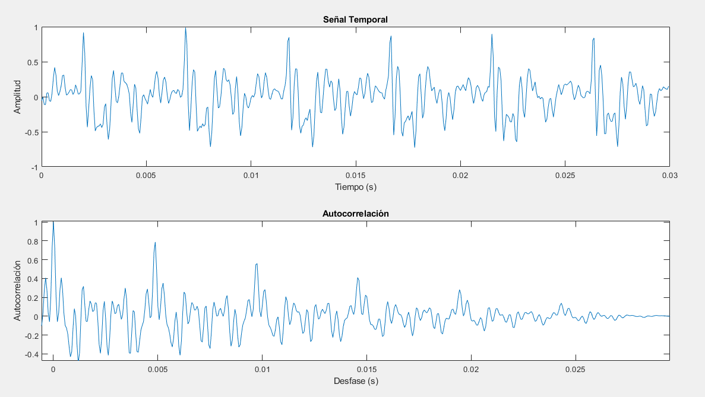

PAV - P3: estimación de pitch
=============================

Esta práctica se distribuye a través del repositorio GitHub [Práctica 3](https://github.com/albino-pav/P3).
Siga las instrucciones de la [Práctica 2](https://github.com/albino-pav/P2) para realizar un `fork` de la
misma y distribuir copias locales (*clones*) del mismo a los distintos integrantes del grupo de prácticas.

Recuerde realizar el *pull request* al repositorio original una vez completada la práctica.

Ejercicios básicos
------------------

- Complete el código de los ficheros necesarios para realizar la estimación de pitch usando el programa
  `get_pitch`.

   * Complete el cálculo de la autocorrelación e inserte a continuación el código correspondiente.

    void PitchAnalyzer::autocorrelation(const vector<float> &x, vector<float> &r) const {

    for (unsigned int l = 0; l < r.size(); ++l) {
  		/**
       \TODO Compute the autocorrelation r[l]

       \DONE Se ha calculado la autocorrelación \f(\frac{1}{N} \sum_n x[n]x[n-l]\f).
       - En este bloque de código, se realiza el cálculo de la autocorrelación mediante el método de autocorrelación directa.
       - Se suman los productos cruzados de las muestras de la señal en el dominio del tiempo, retrasadas por un cierto desplazamiento \f$ l \f$.
       - Posteriormente, se normaliza el resultado dividiendo por el número total de muestras.
      */

      r[l]=0;
      for(unsigned int n=l; n< x.size(); n++){
        r[l] += x[n]*x[n-l];
      }
      r[l] /= x.size();
    }

    if (r[0] == 0.0F) //to avoid log() and divide zero 
      r[0] = 1e-10; 
  }

   * Inserte una gŕafica donde, en un *subplot*, se vea con claridad la señal temporal de un segmento de
     unos 30 ms de un fonema sonoro y su periodo de pitch; y, en otro *subplot*, se vea con claridad la
	 autocorrelación de la señal y la posición del primer máximo secundario.

   

	 NOTA: es más que probable que tenga que usar Python, Octave/MATLAB u otro programa semejante para
	 hacerlo. Se valorará la utilización de la biblioteca matplotlib de Python.

   * Determine el mejor candidato para el periodo de pitch localizando el primer máximo secundario de la
     autocorrelación. Inserte a continuación el código correspondiente.
 
    vector<float>::const_iterator iR = r.begin(), iRMax = iR;

    /// \TODO 
	  /// Find the lag of the maximum value of the autocorrelation away from the origin. 
	  /// Choices to set the minimum value of the lag are:
	  ///    - The first negative value of the autocorrelation.
	  ///    - The lag corresponding to the maximum value of the pitch.
    ///	   .
	  /// In either case, the lag should not exceed that of the minimum value of the pitch.

    for(iRMax = iR = r.begin() + npitch_min; iR < r.begin() + npitch_max; iR++){ 
      // The maximum value of the autocorrelation within the pitch range is determined
      if(*iR > *iRMax){
        iRMax = iR;   // Update the pointer to the maximum value
      }
    }

    // Calculate the lag corresponding to the maximum value of the autocorrelation
    unsigned int lag = iRMax - r.begin();

    float pot = 10 * log10(r[0]);

   * Implemente la regla de decisión sonoro o sordo e inserte el código correspondiente.
    bool PitchAnalyzer::unvoiced(float zcr, float r1norm, float rmaxnorm, float pot) const {
    /// \TODO Implement a rule to decide whether the sound is voiced or not.
    /// * You can use the standard features (pot, r1norm, rmaxnorm),
    ///   or compute and use other ones.

    // Rule to determine if the sound is voiced or unvoiced
    // Count the number of conditions satisfied
    int voiced = 0;                 

    // Check if the maximum autocorrelation value is above a threshold
    if(rmaxnorm > r2maxth) voiced++; 

    // Check if the first normalized autocorrelation value is above a threshold
    if(r1norm > r1r0th) voiced++;    

    // Check if the zero crossing rate (ZCR) is below a threshold
    if(zcr < zcrth) voiced++;         

    // Check if the power is above a threshold
    if(pot > potth) voiced++;

    // If all conditions are satisfied, consider the sound as voiced
    if(voiced == 4) return false;  // Voiced
    return true;                    // Unvoiced

    /**
     * \DONE Se ha implementado una regla para decidir si el sonido es sonoro o no.
     * - Se han proporcionado comentarios para explicar cómo se determina si un sonido es sonoro o no.
     * - Se ha añadido una explicación clara de las condiciones utilizadas y cómo afectan la clasificación del sonido.
     */
    }

   * Puede serle útil seguir las instrucciones contenidas en el documento adjunto `código.pdf`.

- Una vez completados los puntos anteriores, dispondrá de una primera versión del estimador de pitch. El 
  resto del trabajo consiste, básicamente, en obtener las mejores prestaciones posibles con él.

  * Utilice el programa `wavesurfer` para analizar las condiciones apropiadas para determinar si un
    segmento es sonoro o sordo. 
	
	  - Inserte una gráfica con la estimación de pitch incorporada a `wavesurfer` y, junto a ella, los 
	    principales candidatos para determinar la sonoridad de la voz: el nivel de potencia de la señal
		(r[0]), el valor de la autocorrelación en su máximo secundario (rmaxnorm = r[lag] / r[0]) y la autocorrelación normalizada de uno (r1norm = r[1] / r[0]).
    
    En el gráfico se muestran en orden de arriba a abajo; el nivel de potencia de la señal, el valor de rmaxnorm y la autocorrelación normalizada.
    

		Puede considerar, también, la conveniencia de usar la tasa de cruces por cero.

      - Use el estimador de pitch implementado en el programa `wavesurfer` en una señal de prueba y compare
	    su resultado con el obtenido por la mejor versión de su propio sistema.  Inserte una gráfica
		ilustrativa del resultado de ambos estimadores.
     
    La estimación del pitch de wavesurfer junto a nuestra estimación tiene un resultado muy satisfactorio:
    
  
  * Optimice los parámetros de su sistema de estimación de pitch e inserte una tabla con las tasas de error
    y el *score* TOTAL proporcionados por `pitch_evaluate` en la evaluación de la base de datos 
	`pitch_db/train`..

    Resultado final : 90,89%
    

Ejercicios de ampliación
------------------------

- Usando la librería `docopt_cpp`, modifique el fichero `get_pitch.cpp` para incorporar los parámetros del
  estimador a los argumentos de la línea de comandos.
  
  Esta técnica le resultará especialmente útil para optimizar los parámetros del estimador. Recuerde que
  una parte importante de la evaluación recaerá en el resultado obtenido en la estimación de pitch en la
  base de datos.

  * Inserte un *pantallazo* en el que se vea el mensaje de ayuda del programa y un ejemplo de utilización
    con los argumentos añadidos.

- Implemente las técnicas que considere oportunas para optimizar las prestaciones del sistema de estimación
  de pitch.

  Entre las posibles mejoras, puede escoger una o más de las siguientes:

  * Técnicas de preprocesado: filtrado paso bajo, diezmado, *center clipping*, etc.
  * Técnicas de postprocesado: filtro de mediana, *dynamic time warping*, etc.
  * Métodos alternativos a la autocorrelación: procesado cepstral, *average magnitude difference function*
    (AMDF), etc.
  * Optimización **demostrable** de los parámetros que gobiernan el estimador, en concreto, de los que
    gobiernan la decisión sonoro/sordo.
  * Cualquier otra técnica que se le pueda ocurrir o encuentre en la literatura.

  Encontrará más información acerca de estas técnicas en las [Transparencias del Curso](https://atenea.upc.edu/pluginfile.php/2908770/mod_resource/content/3/2b_PS%20Techniques.pdf)
  y en [Spoken Language Processing](https://discovery.upc.edu/iii/encore/record/C__Rb1233593?lang=cat).
  También encontrará más información en los anexos del enunciado de esta práctica.

  Incluya, a continuación, una explicación de las técnicas incorporadas al estimador. Se valorará la
  inclusión de gráficas, tablas, código o cualquier otra cosa que ayude a comprender el trabajo realizado.

  También se valorará la realización de un estudio de los parámetros involucrados. Por ejemplo, si se opta
  por implementar el filtro de mediana, se valorará el análisis de los resultados obtenidos en función de
  la longitud del filtro.
   

Evaluación *ciega* del estimador
-------------------------------

Antes de realizar el *pull request* debe asegurarse de que su repositorio contiene los ficheros necesarios
para compilar los programas correctamente ejecutando `make release`.

Con los ejecutables construidos de esta manera, los profesores de la asignatura procederán a evaluar el
estimador con la parte de test de la base de datos (desconocida para los alumnos). Una parte importante de
la nota de la práctica recaerá en el resultado de esta evaluación.
